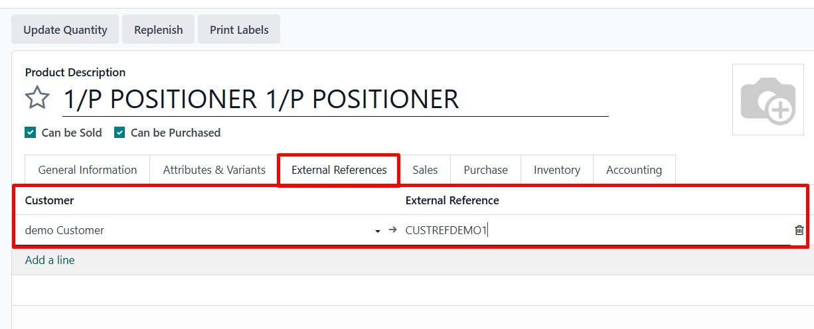
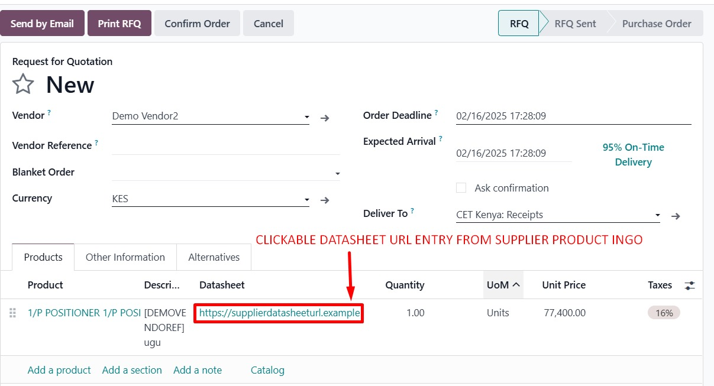
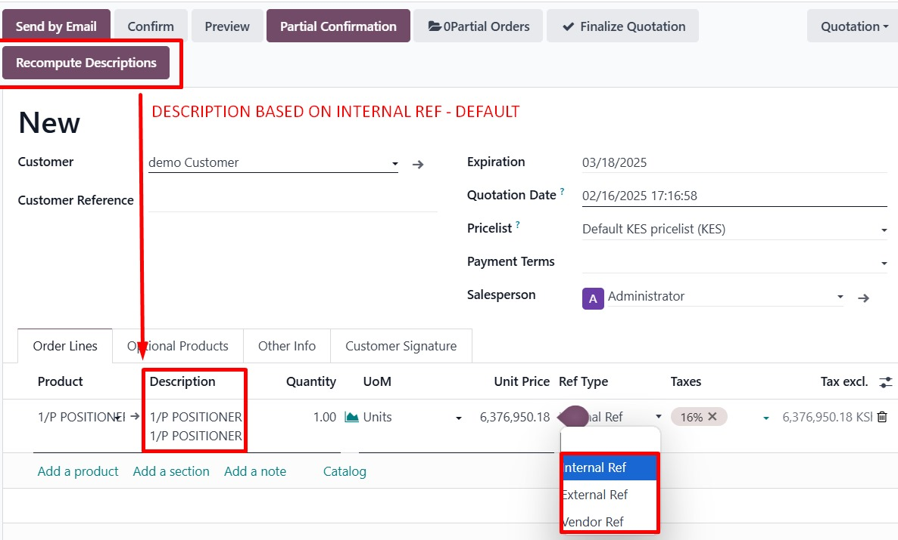

# Product External References by Customer

**Version:** 17.0.1.0.0  
**Price:** USD 150.8  
**License:** LGPL-3

## Overview

This module enables you to store and manage customer-specific external references for products. It enhances your sales and purchase processes by integrating additional reference data and vendor datasheet URLs into your orders.

## Key Features

- **External References:**  
  Store multiple external references for each product, tailored to specific customers.

- **Datasheet URL Integration:**  
  Easily manage and display datasheet URLs in supplier information, purchase orders, and sales orders.

- **Enhanced Sales Order Workflow:**  
  Add a recompute button to refresh order line descriptions based on:
  - Internal product reference.
  - Customer-specific external reference.
  - Vendor reference and datasheet.

- **Seamless Integration:**  
  Extends core Odoo models (`product.template`, `product.supplierinfo`, `purchase.order`, `sale.order`) with minimal configuration.

## Installation

1. **Place the Module:**  
   Copy the `product_external_ref_tag` folder into your Odoo custom addons directory.

2. **Update App List:**  
   Restart your Odoo server and update the Apps list.

3. **Install the Module:**  
   Find **Product External References by Customer** in the Apps menu and click Install.

## Usage

### Product Template
- **External References Tab:**  
  Access and manage customer-specific external references via the new tab in the product template form.

### Supplier Information
- **Datasheet URL Field:**  
  A new datasheet URL field appears in supplier information forms and tree views.

### Purchase Orders
- **Datasheet URL on Order Lines:**  
  The module automatically fills the datasheet URL field based on the vendor’s supplier info when the product or vendor changes.

### Sales Orders
- **Reference Types:**  
  Sales order lines now support three reference types:
  - **Internal Ref:** Uses the product's internal default code.
  - **External Ref:** Fetches the customer-specific external reference.
  - **Vendor Ref:** Uses the vendor’s product code and datasheet URL.
  
- **Recompute Descriptions Button:**  
  A new button in the sales order header triggers the recompute of line descriptions.

## Screenshots

Includes high-quality screenshots of:
- The External References tab on the product template.
- Datasheet URL fields in supplier info.
- Updated purchase order and sales order views.
  

## FAQs

For more details, please refer to the [FAQ.md](FAQ.md) file.

## Support

For any queries or support requests, please contact:  
**Email:** support@odoo.co.ke  
**Website:** [odoo.co.ke](https://www.odoo.co.ke)

## Changelog

Please see the [CHANGELOG.md](CHANGELOG.md) for release history.

---

Thank you for choosing **Product External References by Customer**. We are committed to enhancing your Odoo experience!
