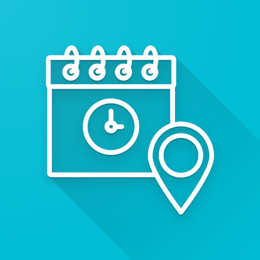
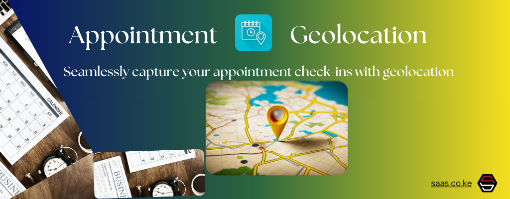
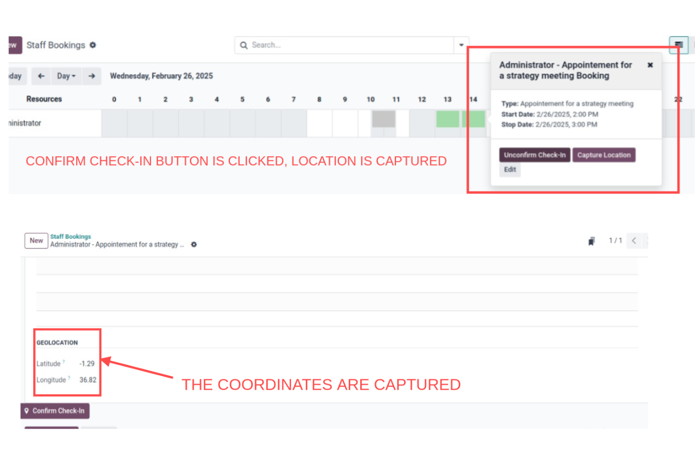
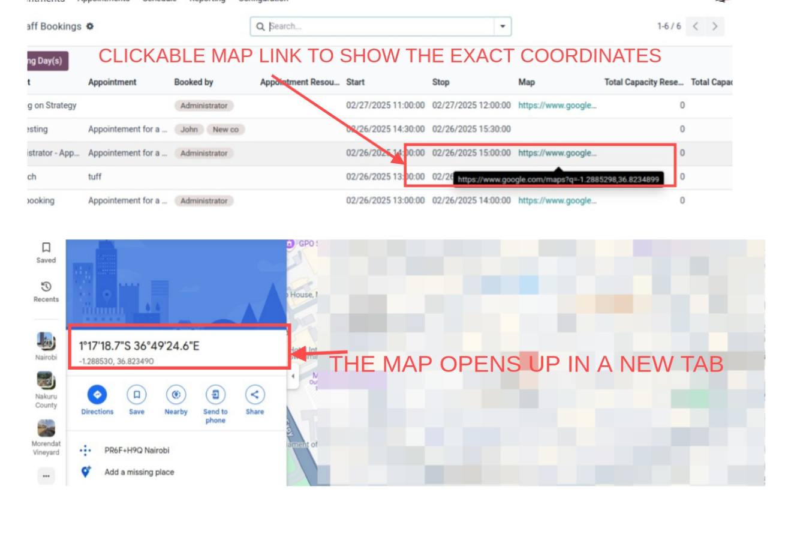

# Appointment Geolocation

## Overview

Appointment Geolocation enhances the calendar event form by capturing your current geolocation (latitude and longitude) when an employee confirms check-in. A clickable Google Maps link is generated based on the captured coordinates, making it easy to visualize the appointment location.

## Features

- **Geolocation Capture:** Automatically records latitude and longitude upon check-in.
- **Clickable Map Link:** Generates a Google Maps URL from the captured coordinates.
- **Integrated Check-In:** Adds a **Confirm Check-In** button to the appointment form.
- **Gantt View Integration:** Provides a **Capture Location** button in the Gantt popover for quick geolocation capture.
- **Reset Functionality:** Offers a mechanism to reset the geolocation data (latitude and longitude) to 0.0.

## Installation

1. **Place Module:**
   - Copy the module folder into your custom addons directory.

2. **Update Odoo:**
   - Restart your Odoo server.
   - Update the Apps list from the Apps menu.

3. **Install Module:**
   - Locate **Appointment Geolocation** in the Apps menu and install the module.

## Usage

- **On the Calendar Event Form:**  
  Open an appointment to view the additional geolocation fields (latitude, longitude, and a clickable map link). Click the **Confirm Check-In** button to capture your current location.

- **In the Gantt View:**  
  Click the **Capture Location** button in the Gantt popover to quickly record your geolocation.

## Screenshots

- **Gantt View Popover:**  
  

- **Map Link Preview:**  
  

## FAQ

**Q: What happens if my browser doesn't support geolocation?**  
A: The module will display a notification and fall back to the default check-in behavior.

**Q: Can I reset the captured geolocation?**  
A: Yes, the module provides a mechanism to reset the geolocation fields to 0.0 via the uncheck-in functionality.

**Q: How is the Google Maps link generated?**  
A: It uses the captured latitude and longitude to create a URL in the format:  
`https://www.google.com/maps?q=latitude,longitude`

## Support

For support or further inquiries, please contact: [support@metroict.com](mailto:support@metroict.com).

## License

This module is licensed under the LGPL-3 License.
